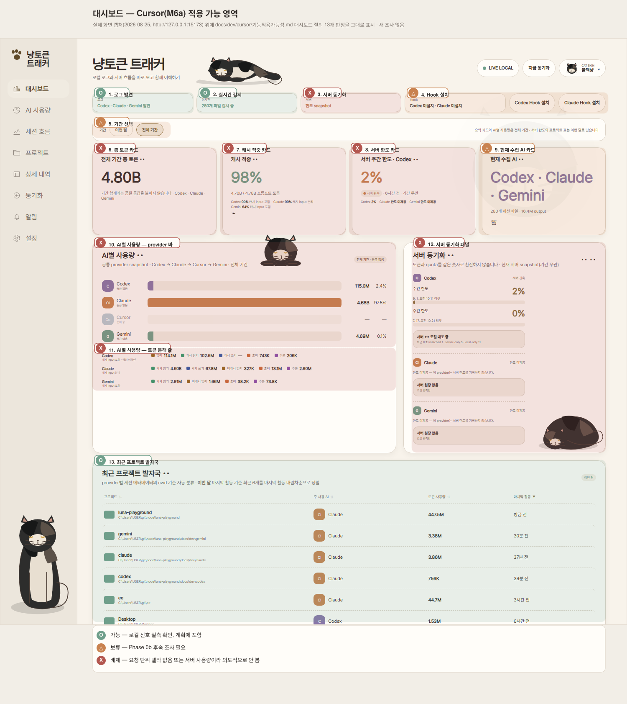

# Cursor 적용 가능성 표 (M6a)

[LLM별 기능지원표.md](../LLM별%20기능지원표.md)는 Claude/Codex/Gemini/Cursor 4종을
나란히 놓고 **지금 코드가 무엇을 지원하는가**를 봅니다. 그 표의 Cursor 열은 거의
전부 X·△인데, 그 이유가 "신호가 없어서"인지 "신호는 있는데 아직 코드가 없어서"인지가
한 글자로는 안 갈립니다. 이 문서는 그 질문 하나만 봅니다 — **화면/기능 단위로, 이번
M6a 트랙에 Cursor를 적용할 수 있는가.** 표 양식은 [LLM별 기능지원표.md](../LLM별%20기능지원표.md)와
같은 O/△/X를 그대로 씁니다.

**행 기준: 실제 화면 코드를 먼저 읽었습니다.** 처음 버전은 메뉴마다 3~4개 항목만
적었는데, 그건 제가 기억으로 고른 것이었고 실제로는 각 `src/views/*.jsx` 파일 안의
화면 요소 수가 훨씬 많았습니다(예: 대시보드는 수집 상태 칩 4개 + 요약 카드 4개 +
AI별 사용량 패널 2개 + 서버 동기화 패널 + 최근 프로젝트 발자국). 그래서 다시
`src/views/DashboardView.jsx` · `UsageView.jsx` · `ProjectView.jsx` · `SessionView.jsx`
· `DetailView.jsx` · `BudgetView.jsx` · `AlertView.jsx` · `SettingsView.jsx`를 전부
읽고, 그 안의 JSX 섹션 하나하나를 행으로 옮겼습니다. 판단 근거는 여전히
[measurements.md](./measurements.md)/[decisions.md](./decisions.md)의 기존
실측이고, 새로 조사한 로컬 데이터는 없습니다 — 화면 쪼갠 것만 다시 했습니다.

## 표기 범례

| 표기 | 뜻 |
|---|---|
| **O** | 필요한 신호가 로컬에서 실측 확인됐고, 지금 계획(Phase 1~3)에 이미 들어 있음 — 적용 가능 |
| **△** | 신호가 있을 수도 있지만 아직 확인 안 됨, 또는 화면 하나가 여러 지표를 묶고 있는데 그중 일부만 됨 — 이번 트랙에서는 그 부분만 채우거나 보류 |
| **X** | 필요한 신호 자체가 로컬에 없거나(요청 단위 델타를 전제), 서버 사용량처럼 이 트랙이 의도적으로 안 보는 대상 — 적용 배제 |

## 대시보드 (`DashboardView.jsx`)

이 화면에는 수집 상태 칩 4개, 기간 선택, 요약 카드 4개, AI별 사용량 패널(바
차트+분해 줄), 서버 동기화 패널, 최근 프로젝트 발자국이 있습니다. 처음 버전은 이 중
3개(총 토큰 표시·최근 발자국·캐시 적중)만 적어서 **서버 API 의존 항목(서버 동기화
칩·요약 카드의 서버 한도·서버 동기화 패널)을 빼먹었습니다** — 아래 표가 전체입니다.

와이어프레임이 아니라 **이 화면을 실제로 캡처한 것**에 아래 표 13개 판정을 그대로
표시했습니다 — 표만 보고 어느 화면 요소를 가리키는지 헷갈리는 걸 막기 위해서입니다.

| 화면/기능 | 필요한 신호 | 로컬 실측 상태 | 적용 | 비고 |
|---|---|---|---|---|
| 수집 상태 칩 — 로그 발견 | 로컬 파일/DB 존재 감지 | 실측됨 — `~/.cursor/chats`, `state.vscdb` 존재 확인 | **O** | `collector.detected`에 그대로 연결 |
| 수집 상태 칩 — 실시간 감시 | 파일 watcher 활성 | 결정3(SQLite content-hash 스냅샷, byte-tail 아님)이라 "감시"의 의미가 다름 | **O** | 문구를 "파일 감시 중"이 아니라 "주기 재스캔"으로 다르게 표기해야 함 |
| 수집 상태 칩 — 서버 동기화 | Admin API 서버 사용량 | 이 트랙이 의도적으로 안 봄(결정 0) | **X** | 아래 "요약카드 서버 한도"·"서버 동기화 패널"과 같은 항목 — M6b의 몫 |
| 수집 상태 칩 — Hook 설치/해제 버튼 | `cursor-agent` CLI의 lifecycle hook 계약 | 미확인 — 조사한 적 없음 | **△** | `capabilities.hooks: false`로 버튼 자체를 숨김(Gemini와 같은 경로) |
| 기간 선택(이번 달/전체 기간) | 기간별 로컬 집계 | breakdown은 "그 순간의 스냅샷"이라 기간 **합산**이 아니라 그 기간의 **마지막 관측값**만 가능 | **△** | 다른 provider와 "기간"이 뜻하는 바가 다름 — 표기로 구분해야 함 |
| 요약카드 — {기간} 총 토큰 | 요청 단위 토큰 델타 | 없음 — [measurements.md 3차 조사](./measurements.md#확인된-것-3차-조사--다른-db-파일에-있는-건-아닌가-재확인-나머지-표면-전부-스캔): 평문 JSON blob 3,629개·이진 blob 95,722개·`workspaceStorage` 62개 DB·`conversation-search.db`·체크포인트 메타·Chromium 표준 저장소 전수 스캔에서 0건 | **X** | 대신 마지막 관측 `context_total_tokens`/`context_window_tokens`(예: 27,766/200,000)를 표시 |
| 요약카드 — 캐시 적중 | 캐시read + 비캐시input + output | 없음(위와 동일) | **X** | `accounting: 'context_only'`면 얼리 리턴 |
| 요약카드 — 현재 수집 AI (연결 여부·세션 파일 수·output 토큰) | 연결 여부(O) + 대화 파일 수(O) + output 토큰(X) | 셋 중 둘은 됨 | **△** | output 토큰 칸만 "—"로 남김 |
| AI별 사용량 — provider 토큰 바 차트 | 요청 단위 토큰 델타 | 없음(위와 동일, 3차 조사로 재확인) | **X** | 다른 provider들과 같은 막대에 안 넣음(R7) |
| AI별 사용량 — 토큰 분해 줄(입력/캐시/출력/추론) | 요청 단위 토큰 분해 | 없음(위와 동일, 3차 조사로 재확인) | **X** | |
| 서버 동기화 패널(한도 게이지 + 대조 상태 박스) | Admin API 서버 사용량 | 위 "서버 동기화" 칩과 동일 | **X** | 화면엔 아예 안 나타남(provider가 quota 없으면 패널 자체가 생략됨) |
| 최근 프로젝트 발자국 | cwd + 최근 활동 시각 | 실측됨 — CLI `meta.json.cwd`/`updatedAtMs`, IDE `workspaceIdentifier`/`composerHeaders.lastUpdatedAt` | **O** | 이미 있는 정렬 로직에 그대로 얹힘 |

## AI 사용량 (`UsageView.jsx`)

| 화면/기능 | 필요한 신호 | 로컬 실측 상태 | 적용 | 비고 |
|---|---|---|---|---|
| 토큰 종류별 추이(기간×버킷 누적 막대) | 요청 단위 토큰 델타 | 없음 | **X** | 항상 0인 막대가 생겨 R7 위반 |
| **(신규) "Cursor — 컨텍스트 구성" 패널** | `5.1`(총 토큰)/`5.2`(창 크기)/`5.3.3[]`(카테고리별 토큰) | 실측됨 — CLI+IDE 이진 blob 1,818개에서 카테고리 합이 총합과 100% 일치(불일치 0) | **O** | 별도 엔드포인트(`GET /api/v1/cursor/context`)로 — 기존 시계열 계약과 안 섞음 |
| 모델별 비중 차트 | 요청 단위 모델명 + 토큰 | 부분 — `ai_code_hashes.model`은 코드 diff 귀속용이라 요청 단위 토큰과 못 묶임 | **X** | 모델명 자체는 있어도 그 모델이 쓴 토큰 수가 없음 |
| provider별 상세 표(입력/캐시읽기/캐시쓰기/출력/추론/합계/품질 열) | 요청 단위 토큰 카테고리 전부 | 없음 | **X** | 위 시계열과 같은 회계 — 별도 조사 필요 없음 |

## 프로젝트 (`ProjectView.jsx`)

`ProjectView.jsx:219`의 안내 문구("Cursor는 Admin API가 프로젝트 정보를 주지
않아 이 목록에 나타나지 않습니다")는 **M6a 실측 이전 서술이라 이미 사실이 아닙니다**
— cwd는 로컬에서 확인됩니다. 이 화면이 실제로 만들어지면 그 문구도 같이 고쳐야
합니다.

| 화면/기능 | 필요한 신호 | 로컬 실측 상태 | 적용 | 비고 |
|---|---|---|---|---|
| 프로젝트 목록(이름/cwd/토큰/provider, 검색·정렬) | cwd 문자열 | 실측됨 — CLI `meta.json.cwd`, IDE `composerHeaders.value.workspaceIdentifier`/`trackedGitRepos` | **O** | Claude/Codex/Gemini와 같은 `projectNameFromCwd()` 재사용 |
| 프로젝트 상세 — 총 토큰/세션 수/모델 수/최근 활동 카드 | 요청 단위 토큰(총 토큰·모델 수) + 세션 수(O) + 최근활동(O) | 절반만 됨 | **△** | 세션 수·최근 활동만 채우고 총 토큰·모델 수는 "—" |
| 프로젝트 상세 — 별칭 입력 + 경로 가림 버튼 | 없음 — 엔진 공용 메커니즘 | 메커니즘 자체는 provider 무관(`project_aliases`, [LLM별 기능지원표 상세.md #16](../LLM별%20기능지원표%20상세.md)) | **O** | Cursor 귀속이 붙는 순간 별도 구현 없이 자동 적용 |
| 프로젝트 상세 — 모델 분포(gauge-list) | 요청 단위 모델별 토큰 | 없음 | **X** | |
| 프로젝트 상세 — 세션 표 + 클릭 시 턴 분석 펼침 | 요청 단위 세션 집계 + 턴 상세(`SessionTurnAnalysis` 재사용) | 없음 | **X** | 세션 흐름 화면과 완전히 같은 컴포넌트·같은 이유로 배제 |
| **(신규) "Cursor 활동" 보조 카드**(요청 수·컨텍스트 breakdown·변경 라인) | role='user' blob 개수, `5.1`~`5.3.3[]`, `totalLinesAdded/Removed` | 전부 실측됨 | **O** | `cursor_local_activity` 한 테이블에서 다 나옴 — 위 "△" 카드가 못 채우는 자리를 이 카드가 대신 채움 |

## 세션 흐름 (`SessionView.jsx`)

| 화면/기능 | 필요한 신호 | 로컬 실측 상태 | 적용 | 비고 |
|---|---|---|---|---|
| 세션 순위(총 토큰 정렬) | 요청 단위 토큰 델타 | 없음 | **X** | 정렬 기준 자체가 성립 안 함 |
| 컨텍스트 곡선(요청별 프롬프트 크기 추이) | 요청 단위 prompt tokens | 없음 — breakdown은 스냅샷이라 요청별 시계열이 아님 | **X** | `5.1`을 스냅샷마다 이어 그리면 재독 배수 같은 왜곡이 생김(agy 사례와 동일 위험) |
| 단계별 배분(도구→작업단계) | 도구 이름 + phase 매핑표 | 도구 이름은 구조적으로 얻을 가능성이 있으나(blob `role='tool'`) phase 매핑표가 비어 있음(`tool-phases.mjs`의 `cursor: {}`) | **△** | 어휘를 실측해 표를 채우는 건 이번 트랙 범위 밖 — 채워도 전부 `other` |
| 비싼 턴 목록 | 턴 경계 + 턴 단위 토큰 델타 | 미확인 — `conversation` 카테고리 증가량이 후보이나 사용자/어시스턴트 델타를 못 가름(Phase 0b) | **△** | Phase 0b가 델타 분리를 확정하기 전까진 만들지 않음 |

## 상세 내역 (`DetailView.jsx`)

| 화면/기능 | 필요한 신호 | 로컬 실측 상태 | 적용 | 비고 |
|---|---|---|---|---|
| 프로젝트→세션→도구 토큰량 표(비용순/시간순) | 요청 단위 토큰 델타 + 턴 상세 | 없음 | **X** | 세션 흐름과 같은 이유 |
| 도구 호출 본문 보기 팝업(`ToolContentModal`) | 원본 파일/레코드 재열람 | Cursor는 blob `content`를 **원칙적으로 절대 읽지 않기로 결정**함(결정 2) | **X** | 다른 X와 성격이 다릅니다 — "신호가 없어서"가 아니라 "있어도 일부러 안 봄" |

## 동기화 (`BudgetView.jsx`)

| 화면/기능 | 필요한 신호 | 로컬 실측 상태 | 적용 | 비고 |
|---|---|---|---|---|
| provider 상태 카드(연결/감지/오류 표시) | 로컬 저장소 감지 여부 | 실측됨 — 존재 확인만으로 충분 | **O** | `integration: 'connected'`로 승격 |
| Hook 설치/해제 버튼 + 이벤트 목록 | `cursor-agent` CLI의 lifecycle hook 계약 | 미확인 | **△** | `capabilities.hooks: false`로 버튼 자체를 숨김 |
| 서버 한도 게이지 + 한도 이력 차트 + 대조 이력 목록 | Admin API 서버 사용량 | 확인 안 함 — 이 트랙이 의도적으로 안 봄(결정 0) | **X** | M6b의 몫. "없어서"가 아니라 "안 보기로 해서" |
| 진단(세션 수·사용 이벤트 수·한도 snapshot 수·스캔 파일 수·누적 리셋 수) | 5개 지표 중 세션 수·스캔 파일 수는 로컬 카운트, 나머지 3개는 요청단위 원장 개념 | 2/5만 됨 | **△** | `cursor_local_activity` 행 수·스캔한 파일 수는 채우고 나머지는 "—" |

## 알림 (`AlertView.jsx`)

| 화면/기능 | 필요한 신호 | 로컬 실측 상태 | 적용 | 비고 |
|---|---|---|---|---|
| 한도 백분율/토큰 예산/수집 중단 알림 | 요청 단위 토큰 델타 또는 서버 한도 | 둘 다 없음 | **X** | 화면 자체가 미구현(M4)이라 신규 작업 없음 — 나중에 붙어도 Cursor는 자연히 대상 제외 |

## 설정 (`SettingsView.jsx`)

| 화면/기능 | 필요한 신호 | 로컬 실측 상태 | 적용 | 비고 |
|---|---|---|---|---|
| provider 자격증명 입력(현재는 어떤 provider도 실제 입력란이 아니라 "미설정" 고정 문구) | 없음 — 이 트랙은 자격증명을 안 씀 | N/A | **X(불필요)** | 기존 M6 계획보다 오히려 작업이 줄어듦 |
| 데이터(백업/초기화/내보내기) 카운터 | 없음 | N/A | **O** | `cursor_local_activity` 테이블 하나만 백업·초기화 대상에 추가 |

## 구현 방식 (화면이 아니라 수집 계층)

| 항목 | 필요한 신호 | 로컬 실측 상태 | 적용 | 비고 |
|---|---|---|---|---|
| SQLite 스냅샷 스캔(byte-offset tail 대신 content-hash) | 없음 — WAL로 재작성되는 SQLite라는 사실 자체가 근거 | 실측됨(`store.db`/`state.vscdb`가 append-only가 아님) | **O** | Gemini `.json` 전략 재사용(결정 3) |
| 대화 본문 비저장 | 없음 — 오히려 "안 읽는" 것이 요구사항 | 파악됨 — blob의 `role`/`content` 구조, 이진 blob의 필드 경계 | **O** | `role`/카테고리 키만 취하고 `content`는 파서가 절대 안 엶(결정 2) |

## 요약

| 표기 | 개수 |
|---|---|
| **O** | 11 |
| **△** | 8 |
| **X** | 18 |

(전체 37행 — 대시보드 12 · 사용량 4 · 프로젝트 6 · 세션 흐름 4 · 상세 내역 2 ·
동기화 4 · 알림 1 · 설정 2 · 구현 방식 2)

1차 버전(메뉴당 3~4행, 총 24행)보다 행이 늘었지만 판단 근거는 그대로입니다 —
화면을 더 잘게 쪼갰을 뿐, 새로 밝혀진 신호는 없습니다. **X** 18개는 거의 전부
같은 이유 하나(요청 단위 토큰 델타가 로컬에 없음) 아니면 같은 결정 하나(서버
사용량은 이 트랙에서 안 봄)로 갈립니다. **△** 8개는 이유가 넷으로 갈립니다:

- **Hook 계약 미확인**(2개: 대시보드 Hook 칩, 동기화 Hook 패널) — 같은 사실이
  두 화면에 각각 나타난 것입니다.
- **화면 하나가 여러 지표를 섞어 보여주는데 그중 일부만 됨**(3개: 대시보드
  "현재 수집 AI" 카드, 프로젝트 요약 카드, 동기화 진단) — O/X 둘로는 "카드의
  절반만 채운다"는 상황이 안 담겨서 △로 뺐습니다.
- **Phase 0b 후속 조사가 끝나야 정해짐**(2개: 세션 흐름의 단계별 배분·비싼
  턴) — 어휘 확정·델타 분리가 안 끝났습니다.
- **기간의 의미 자체가 다름**(1개: 대시보드 기간 선택) — breakdown은 합산이
  아니라 스냅샷이라, "이번 달"이 다른 provider와 같은 뜻이 아닙니다.
