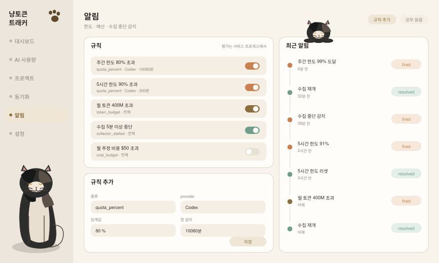

# 알림 (`alert`)

**현재 상태: 미구현.**

알림은 세 가지를 잡습니다. **한도 소진**(서버 관측), **예산 초과**(로컬 관측/추정), **수집 중단**(도구 자체 고장). 세 번째가 특히 중요합니다 — 조용히 수집이 멈춘 트래커는 0을 보여주면서 "사용량이 없다"고 거짓말합니다.

## 화면 미리보기



## 화면 요소

| 영역 | 내용 |
|---|---|
| 규칙 목록 | 규칙명, 조건 요약, 켜기/끄기 토글 |
| 규칙 추가 | 종류 · provider · 임계값 · 창 길이 |
| 최근 알림 | 발생/해제 타임라인, 상태 배지 |

## 규칙 종류

| `kind` | 조건 | 원본 |
|---|---|---|
| `quota_percent` | `usedPercent >= threshold` (창 지정) | 서버 한도 snapshot |
| `token_budget` | 기간 내 총 토큰 >= threshold | 로컬 원장 |
| `cost_budget` | 기간 내 추정/실측 비용 >= threshold | M7 이후 |
| `collector_stalled` | `now - lastScanAt >= threshold`(분) 또는 `lastError` 존재 | 수집기 상태 |

`quota_percent`는 `(provider, limitId, windowMinutes)`까지 지정합니다. Codex는 5시간 창과 주간 창이 동시에 있고, 모델별 `limit_id`가 따로 존재하므로 "80%"만으로는 대상이 정해지지 않습니다.

## 평가 위치 — 서비스 프로세스

**클라이언트에서 평가하지 않습니다.** 이유:

1. 브라우저 탭을 닫아도 알림은 동작해야 합니다.
2. 여러 탭이 열려 있으면 같은 규칙이 여러 번 발화합니다.
3. 규칙 평가에는 이력 조회가 필요하고, 그건 서버 쪽 쿼리입니다.

평가 시점은 **엔진이 스냅샷을 만든 직후**입니다. 이미 `UsageEngine`이 `snapshot` 이벤트를 발신하므로(`service/engine.mjs`), 그 지점에 평가기를 붙이면 파일 변경·hook·주기 reconcile 모두가 자동으로 평가 트리거가 됩니다.

```js
// service/alerts/evaluator.mjs (신규)
class AlertEvaluator {
  constructor({ store }) {}
  evaluate(snapshot) { /* 규칙별 판정 → fired/resolved 기록 → 이벤트 반환 */ }
}
```

## 상태 전이

```text
미발화 ──(조건 충족)──> fired ──(조건 해제)──> resolved
             ^                                    |
             └──────────(재충족)───────────────────┘
```

- 같은 규칙이 연속 충족돼도 `fired`를 반복 기록하지 않습니다(중복 알림 방지).
- 한도 리셋(`resetsAt` 경과 또는 percent 하락)은 `resolved` 트리거입니다.
- `collector_stalled`는 스캔이 재개되면 `resolved`.

## API

```
GET    /api/v1/alerts                 → { rules: [...], recent: [...] }
POST   /api/v1/alerts                 { kind, provider, threshold, windowMinutes }
PATCH  /api/v1/alerts/:id             { enabled?, threshold?, windowMinutes? }
DELETE /api/v1/alerts/:id
POST   /api/v1/alerts/:id/test        → 규칙을 현재 스냅샷에 즉시 적용(발화 기록 없이 결과만)
```

전달은 SSE로 합니다. 기존 `snapshot` 이벤트와 구분되는 새 이벤트 타입을 추가합니다.

```text
event: alert
data: {"ruleId":3,"kind":"quota_percent","state":"fired","value":99,"provider":"codex","firedAt":"..."}
```

`docs/http-sse-transport.md`는 현재 `snapshot` 이벤트 하나만 문서화하고 있으므로, 이벤트 종류가 늘어나면 그 문서를 갱신해야 합니다.

## OS 알림

브라우저 `Notification` 권한이 필요하고, 탭이 닫혀 있으면 표시되지 않습니다. 그래서 순서를 이렇게 둡니다.

1. (M4) 앱 내 목록 + SSE — 탭이 열려 있을 때 즉시
2. (후속) 브라우저 알림 — 사용자가 권한을 준 경우에만
3. (후속) 데스크톱 알림 — 서비스가 OS 알림을 직접 띄우는 경로. 플랫폼별 구현이 필요하므로 별도 판단

## 상태 처리

| 상황 | 표시 |
|---|---|
| 규칙 0개 | 추천 규칙 3개(주간 80%, 5시간 90%, 수집 중단 5분) 제시 |
| 대상 provider 미연결 | 규칙은 유지, `대기 중` 표기 |
| 한도 원본이 없는 provider에 `quota_percent` | 생성 시점에 거부하고 이유 표시 |
| 알림 이력 없음 | 빈 상태 |

## 완료 기준

- [ ] 서비스 프로세스가 평가하고, 브라우저를 닫아도 `alert_events`에 기록됨
- [ ] 연속 충족 시 중복 `fired`가 생기지 않음
- [ ] 한도 리셋 후 `resolved`가 기록됨
- [ ] 수집기를 5분 이상 정지시키면 `collector_stalled`가 발화함 (테스트로 시간 주입)
- [ ] 한도 원본이 없는 provider에 대해 `quota_percent` 규칙 생성이 거부됨

## 하지 않는 것

- 클라이언트에서 규칙 평가
- 사용량을 예측해 "이 속도면 초과 예상" 같은 추정 알림 (M7 이후 별도 판단)
