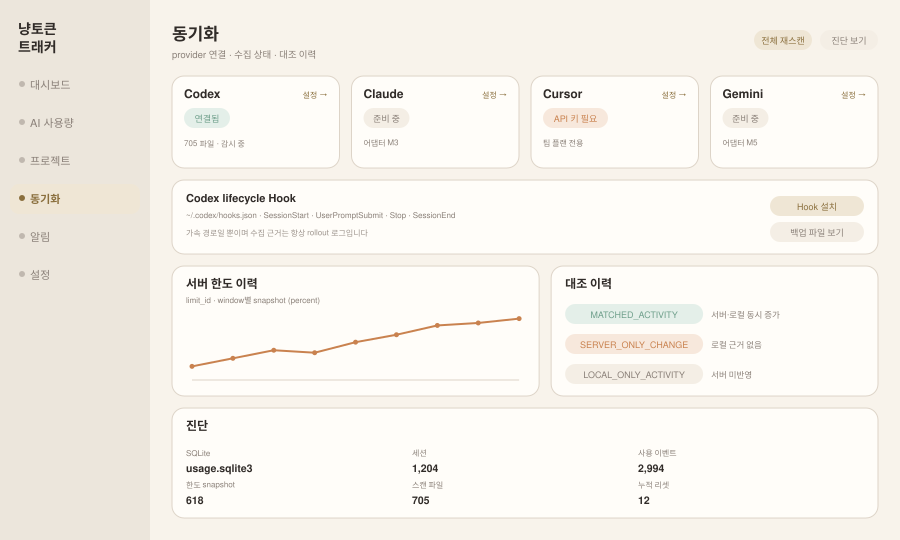

# 동기화 (`budget`)

**현재 상태: 구현됨 (M4의 동기화 절반).** 화면은 `src/views/BudgetView.jsx`, 한도 추이 스파크라인은 `src/views/QuotaHistory.jsx` 입니다. 대시보드 상단의 수집 칩 4개와 Hook 버튼은 요약으로 남습니다. M4의 나머지 절반인 [알림](./alert.md)은 아직 미구현입니다.

메뉴 식별자가 `budget`인데 라벨이 `동기화`인 것은 코드가 먼저 정해진 결과입니다(`src/App.jsx:13`). 예산 기능은 [알림](./alert.md)과 M7로 갔으므로, 이 화면은 **provider 연결과 수집 신뢰성**을 담당합니다. 식별자를 바꾸면 저장된 사용자 상태와 어긋나므로 그대로 둡니다.

## 화면 미리보기



## 화면 요소

| 영역 | 내용 |
|---|---|
| provider 카드 4장 | Codex / Claude / Cursor / Gemini 각각의 연결 상태와 감지 결과, 연결된 provider는 마지막 스캔 시각·준비 중인 provider는 설계 문서 경로 — 설정 진입 링크는 없습니다(자격증명 화면이 M6이라 갈 곳이 아직 없음) |
| Hook 제어 | `capabilities.hooks`인 provider마다 설치/해제 카드 — Codex 4종·Claude 5종 이벤트 칩, 백업 파일 이름 |
| 서버 한도 이력 | `limit_id` × window별 백분율 추이 (percent 축, 토큰 아님) |
| 대조 이력 | reconciliation 분류별 타임라인 — 특히 `SERVER_ONLY_CHANGE` |
| 진단 | SQLite 경로, 행 카운터 5종 |

## provider 카드 상태 모델

[provider-token-api.md §8](../provider-token-api.md)의 `getStatus()`를 그대로 표시합니다.

| 상태 | 조건 | 표시 |
|---|---|---|
| 연결됨 | `detected && ledgerAvailable && watching` | 초록, 파일 수/폴링 주기 |
| 감지됨 · 원장 없음 | `detected && !ledgerAvailable` | 주황 — 예: Cursor 개인 계정 |
| 자격증명 필요 | `credentials === 'api_key'` 이고 미설정 | 주황 + 설정 링크 |
| 오류 | `lastError` 존재 | 빨강 + **한 줄 메시지**(스택 금지) |
| 준비 중 | 어댑터 미구현 (`integration: 'planned'`) | 회색 + 해당 마일스톤 표기 |

구현된 것은 다섯 중 셋입니다(`src/views/BudgetView.jsx:26-41`). `ledgerAvailable` 로 갈리는 "감지됨 · 원장 없음"과 `credentials` 로 갈리는 "자격증명 필요"는 코드에 없습니다 — Codex의 `getStatus()` 에는 `ledgerAvailable` 필드 자체가 없고(`service/providers/codex/collector.mjs:54-62`, Claude에는 있습니다 `claude/collector.mjs:61`), 두 상태가 실제로 필요한 provider는 Cursor(M6)입니다. 대신 `detected && !watching` 을 "감지됨 · reconcile 대기", 미감지를 "미발견"으로 표시합니다. "연결됨" 줄은 파일 수만 적고 폴링 주기는 적지 않습니다 — `getStatus()` 가 `reconcileIntervalMs` 를 싣지 않기 때문입니다. 빠진 두 상태를 나중에 채울 때도 provider id가 아니라 이 필드들로 갈라야 합니다(아래 완료 기준 1·2).

## Hook 제어

이미 구현된 API를 그대로 씁니다. 경로는 provider별로 일반화됐습니다 — 정규식 하나가 `:provider` 를 받으므로 기존 `/providers/codex/hooks` 도 같은 핸들러가 답합니다(`service/api-server.mjs:7,222`). 하위 호환용 별도 핸들러는 없습니다.

```
GET    /api/v1/providers/:provider/hooks    → 설치 상태
POST   /api/v1/providers/:provider/hooks    → 설치 후 상태
DELETE /api/v1/providers/:provider/hooks    → 해제 후 상태
```

응답 모양은 provider마다 다릅니다. Codex는 `{ installed, installedEvents, expectedEvents, hooksPath, command }`(`service/providers/codex/hooks.mjs:58-71`), Claude는 여기에 `state`(`installed`/`partial`/`not_installed`, 읽기 실패 시 `conflict`)와 `settingsPath` 가 더 붙습니다(`claude/hooks.mjs:78-99`). 화면은 `settingsPath ?? hooksPath` 로 둘을 함께 받습니다(`src/views/BudgetView.jsx:87`). 어댑터가 없는 provider는 503 `hooks_unavailable` 입니다.

화면에 반드시 넣을 문구: **hook은 가속 경로이고 수집 근거는 항상 로그**라는 점. 사용자가 hook을 끄면 실시간성이 떨어질 뿐 데이터가 사라지지 않습니다.

## 신규 API

둘을 설계했지만 하나만 만들었습니다.

```
GET /api/v1/quota/history?provider=&limitId=&windowMinutes=&since=   ← 구현됨 (service/api-server.mjs:290)
      → { points: [{ limitId, limitName, windowType, windowMinutes, usedPercent, resetsAt, observedAt }] }
```

**`GET /api/v1/reconciliation` 은 만들지 않았습니다.** 대조 이력은 화면이 이미 구독 중인 스냅샷의 `providers[].reconciliation.recent` 를 그대로 읽습니다(`service/engine.mjs:152` → `store.getRecentReconciliation()`, 최근 12건). 같은 행을 REST로 한 번 더 당기면 SSE 스냅샷과 갱신 시점이 어긋난 두 벌이 생깁니다 — 대조 이력은 "지금 상태"라 스냅샷이 맞는 자리이고, 대시보드가 쓰는 `status`/`serverOnly`/`matched`/`localOnly` 요약도 같은 함수에서 이미 나옵니다.

필드 이름도 위 설계안이 아니라 스토어 반환값을 그대로 씁니다: `limitId` / `windowType` / `windowMinutes` / `from` / `to` / `serverUsageDelta` / `localTokenDelta` / `classification` / `confidence`. 설계안의 `fromObservedAt`·`serverDelta`·`localTokens` 라는 이름은 코드에 존재한 적이 없습니다.

되돌릴 조건: 12건보다 긴 이력이나 기간 필터가 필요해지는 순간 — 스냅샷을 키우는 대신 그때 `since`/`limit` 를 받는 엔드포인트를 만듭니다.

두 데이터는 **percent와 토큰을 같은 축에 그리지 않도록** 끝까지 분리해 둡니다. 한도 이력은 percent 시계열, 대조 이력은 분류 목록입니다.

## 대조 이력 표시

`reconciliation_events`의 분류를 그대로 씁니다(`docs/codex-usage.md`).

| 분류 | 화면 문구 | 색 |
|---|---|---|
| `MATCHED_ACTIVITY` | 서버·로컬 동시 증가 | 초록 |
| `SERVER_ONLY_CHANGE` | 서버만 증가 — 로컬 근거 없음 | 주황 |
| `LOCAL_ONLY_ACTIVITY` | 로컬만 증가 — 서버 미반영 | 회색 |
| `RESET` | 한도 리셋 | 파랑 |
| `UNKNOWN` | 의미 있는 변화 없음 | 숨김(기본) |

`SERVER_ONLY_CHANGE`는 "다른 기기에서 썼거나, 클라우드 실행이거나, 지연 정산"입니다. 원인을 추측해 하나로 단정하지 않고 세 가능성을 문구로 남깁니다.

## 진단

`GET /api/v1/diagnostics`가 이미 `dbPath`, `sessions`, `usageEvents`, `rateSnapshots`, `scanFiles`, `cumulativeResets`를 반환합니다. 화면에 그대로 노출하고, **SQLite 경로 열기** 버튼은 두지 않습니다(브라우저에서 로컬 파일 열기는 불가하고, 서비스가 셸을 실행하는 경로를 만들면 안 됩니다).

## 완료 기준

아래 체크는 자동 검사가 아니라 코드 대조로 확인한 것입니다 — 이 화면을 렌더링하는 테스트도, `/api/v1/quota/history` 를 때리는 테스트도 아직 없습니다.

- [x] provider 4종의 카드 상태가 `getStatus()` 값(`integration`/`detected`/`watching`/`lastError`)만으로 결정됨 — `providerState()` 의 다섯 갈래가 전부 이 필드로 갈립니다(`src/views/BudgetView.jsx:26-41`). 유일한 provider id 조회는 "준비 중" 줄 뒤에 붙는 마일스톤 글자(`providerMilestones[provider.id]`, `src/shared.js`)인데, 상태가 아니라 라벨이라 체크는 유지합니다
- [ ] 화면 전체에 하드코딩된 provider 분기가 없음 — 한도·대조 패널은 아직 `providers.find(id === 'codex')` 로 고른 한 provider만 봅니다 (`src/views/BudgetView.jsx:50,56-58`). 서버 한도를 주는 provider가 Codex뿐이라(`capabilities.serverQuota`: codex `true`, claude `false`) 지금 화면이 틀린 값을 보이지는 않지만, 두 번째 provider가 붙는 순간 id가 아니라 `serverQuota` 로 갈라야 합니다. Hook 쪽도 카드를 띄우는 조건만 `capabilities.hooks` 이고(`BudgetView.jsx:61`) 경로·이벤트 기본값(`hookDefaults`, `BudgetView.jsx:15-24`)과 초기 상태를 당기는 목록(`HOOK_PROVIDERS`, `src/App.jsx:31`)은 아직 id 목록입니다 — 세 번째 hook provider가 붙으면 그 카드는 상태를 못 받아 경로 `—` 와 빈 이벤트 칩으로 뜹니다
- [x] Hook 설치/해제 후 상태가 즉시 갱신됨 — 설치·해제 응답이 파일을 다시 읽은 `status()` 이고(`service/providers/codex/hooks.mjs:82,89`, `claude/hooks.mjs:109,115`) 화면이 그 응답으로 상태를 교체합니다(`src/App.jsx:108-109`)
- [x] 한도 이력 축이 percent이고 토큰 값이 섞이지 않음 — 게이지는 `usedPercent` 만 쓰고(`src/views/BudgetView.jsx:116-117`) 스파크라인도 percent 전용 축입니다(`src/views/QuotaHistory.jsx:15`). 토큰은 차트가 아니라 대조 이력 **목록**에만 나오고, 서버 `%p` 와 라벨로 갈라 적습니다(`BudgetView.jsx:136`)
- [x] `lastError` 가 스택트레이스 없이 한 줄로 표시됨 — 수집기가 `String(error?.message ?? error)` 만 담고(`service/providers/codex/collector.mjs:203`, `claude/collector.mjs:247`) 화면이 첫 줄만 씁니다(`src/views/BudgetView.jsx:32`)
- [ ] 자격증명 값이 화면·응답에 나타나지 않음(설정 여부만) — 자격증명을 저장하는 코드가 아직 없어(`service/` 에 자격증명 테이블도 `apiKey` 심볼도 없고, `capabilities.credentials` 는 claude `'none'`) 검증할 대상 자체가 없습니다 (M6에서 확인)

## 하지 않는 것

- 서버 한도와 로컬 토큰을 같은 차트에 겹쳐 그리기
- `SERVER_ONLY_CHANGE`를 로컬 토큰으로 보정해 없애기
- 진단 화면에서 셸 명령이나 파일 탐색기 실행
