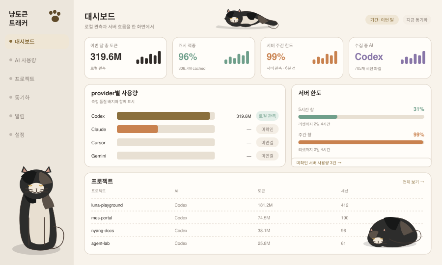

# 대시보드 (`dashboard`)

**현재 상태: 구현됨.** 이 문서는 확장 항목만 다룹니다.

지금 `src/App.jsx`의 `App()` 안에 대시보드 JSX가 인라인으로 들어 있습니다. M1에서 `src/views/DashboardView.jsx`로 **동작 변화 없이** 옮기는 것이 첫 작업입니다.

## 화면 미리보기



## 화면 요소

| 영역 | 현재 | 확장 |
|---|---|---|
| 요약 카드 4장 | 총 토큰 / 캐시 적중 / 서버 한도 / 수집 중 AI | 카드마다 최근 7구간 스파크라인 추가 |
| 기간 선택 | 없음 (월 고정) | 헤더에 `이번 달 / 최근 7일 / 최근 30일` — 스냅샷 `period`를 쿼리로 전환 |
| provider별 사용량 | 4행 막대 (catalog 전체, planned 포함) | 행마다 **측정 품질 배지**. Claude처럼 신뢰도가 낮은 값은 `미확인` |
| 서버 한도 | `quotaWindows` 게이지 | 창별 리셋 잔여 시간 표시, 창이 여러 개인 provider 대응 |
| 미확인 서버 사용량 | 코멘트 문구로만 암시 | 건수 + [동기화 화면](./budget.md)으로 가는 링크 |
| 프로젝트 | 최근 6개 요약 | [프로젝트 화면](./project.md)으로 가는 링크 |
| 고양이 코멘트 | reconciliation 상태별 문구 | 유지 |

## 데이터 소스

추가 API 없이 **기존 스냅샷만으로 대부분 가능**합니다. 스냅샷에는 이미 `totals`, `providers[].quotaWindows`, `providers[].reconciliation`, `projects`가 들어 있습니다.

새로 필요한 것 둘:

```
GET /api/v1/usage/timeseries?bucket=day&limit=7      // 카드 스파크라인
GET /api/v1/snapshot?period=7d|30d|month             // 기간 전환
```

기간 파라미터는 엔진 `snapshot()`이 `startOfLocalMonthIso()`를 고정으로 쓰는 부분을 인자화해야 합니다. SSE 브로드캐스트는 계속 월 기준 기본값을 보내고, 기간을 바꾼 클라이언트는 REST로 다시 당깁니다 — 클라이언트별 기간을 서버가 기억하지 않습니다.

## 품질 배지 규칙

[provider-token-api.md §4](../provider-token-api.md)의 등급을 그대로 표시합니다.

| 등급 | 배지 | 예 |
|---|---|---|
| `server_verified` | 서버 검증됨 | Cursor `chargedCents` |
| `local_exact` | 로컬 관측 | Codex 전체, Gemini 전체 |
| `partial` | 추정 | Claude `output_tokens` (thinking 누락) |
| `unverified` | 미확인 | Claude `input_tokens` (플레이스홀더) |

provider 총합의 배지는 **구성 필드 중 최저 등급**입니다. 총합이 `미확인`이어도 캐시 항목은 `로컬 관측`일 수 있으므로, 카드 툴팁에서 필드별 등급을 보여줍니다.

## 상태 처리

| 상황 | 표시 |
|---|---|
| 수집기 미발견 | `WAITING CODEX` 필 유지, 칩은 `미발견` |
| provider 미연결 (`planned`) | 행은 보이되 값은 `—`, 배지 `미연결` |
| 서버 한도 snapshot 없음 | 게이지 `—`, `snapshot 대기` |
| SQLite 비어 있음 | 카드 0, 프로젝트 영역에 첫 수집 안내 |

## TODO — 확정된 개선 항목

아래는 실제 화면을 보고 확정한 항목입니다. 설계 의도가 아니라 **화면이 틀리게 보이는 것**을 고치는 작업이었고, 둘 다 M9 에서 닫혔습니다. 무엇이 왜 틀렸는지는 되돌릴 때 필요하므로 남겨 둡니다.

### T1. 요약 카드 3장을 provider별로 쪼갠다 — 완료 (M9)

`캐시 적중` · `서버 주간 한도` · `Codex 서버 동기화` 세 항목이 **M9 이전에는** 사실과 다르게 보였습니다. 아래 표의 "지금" 칸은 그때 상태입니다.

| 항목 | 지금 | 문제 | 되어야 하는 것 |
|---|---|---|---|
| 캐시 적중 | provider **합산** 하나 (`totals.cacheRate`) | Codex와 Claude는 캐시 회계가 서로 달라(§`accounting.mjs`) 합산 비율의 의미가 흐려집니다. Codex 5.6만 토큰과 Claude 23억 토큰을 한 비율로 뭉개면 사실상 Claude 값만 보이는 것과 같습니다 | **provider별 캐시 적중률**. 합산값을 보여주려면 분모(`promptTokens`)를 함께 적어 근거를 드러냅니다 |
| 서버 주간 한도 | Codex `quotaWindows`만 | 카드 제목이 "서버 주간 한도"인데 실제로는 **Codex 전용**입니다. Claude는 로컬 로그에 한도가 없어 값이 없는데, 카드만 보면 전체 한도처럼 읽힙니다 | provider별 한도 게이지. 한도를 주지 않는 provider는 **"한도 미제공"**으로 표기 (0%로 채우지 않음, R7) |
| Codex 서버 동기화 패널 | 제목·내용 모두 Codex 고정 | provider가 늘어도 이 패널은 Codex만 봅니다. Claude는 `reconciliation`이 항상 비어 있는데 그 사실이 화면에 없습니다 | provider별 카드로 분리. 서버 관측이 없는 provider는 "서버 원장 없음 — 로컬 관측만"으로 명시 |

핵심 규칙은 이미 문서에 있는 것과 같습니다 — **provider마다 측정 근거가 다르면 화면에서도 갈라 보여야 합니다.** 한 숫자로 합치는 순간 "어느 provider의 사실인지" 알 수 없게 됩니다.

구현 메모:

- 캐시 적중률의 분모는 `provider.totals.promptTokens`(회계 반영됨)를 씁니다. `cachedInputTokens / inputTokens`를 다시 쓰면 Claude에서 수천 %가 됩니다
- 한도는 `provider.capabilities.serverQuota`로 "미제공"을 판단합니다. Claude는 `false`
- 카드 자리가 부족하면 요약 카드는 합산 + 툴팁에 provider별 내역, 상세는 [동기화 화면](./budget.md)에 provider별 카드로 두는 분담도 가능합니다

들어간 것은 그 마지막 분담안입니다.

- 요약 카드는 합산값을 그대로 두고 그 아래 provider별 한 줄을 깝니다. 회계 이름(`캐시 input 포함` / `캐시 input 분리`)과 분모는 툴팁에 적습니다(`src/views/DashboardView.jsx:118-119`, `src/shared.js` 의 `accountingLabels`)
- 서버 동기화 패널은 provider별 블록으로 갈라졌고 제목에서 `Codex` 가 빠졌습니다(`DashboardView.jsx:134-146`)
- 한도·대조 분기는 provider id 가 아니라 `capabilities` 를 봅니다. `serverQuotaState()` 가 `미연결`/`한도 미제공`/`snapshot 대기`/관측됨 네 갈래를 냅니다(`src/shared.js`) — `reconciliation.status` 로 가르지 않는 이유는 snapshot 이 아직 없는 Codex 와 서버 원장 자체가 없는 Claude 가 둘 다 `NO_SERVER_DATA` 이기 때문입니다
- 한도 카드의 큰 숫자는 여전히 provider 하나의 값입니다. 서로 다른 구독의 percent 에는 공통 분모가 없어 평균내지 않고(R5), 사용률이 가장 높은 provider 를 세운 뒤 **카드 제목에 그 이름을 적습니다**

남은 잔여 둘:

- 수집 상태 칩의 `Hook` 은 아직 Codex 상태만 보여줍니다 — `src/App.jsx:123` 이 `hookStatuses.codex` 만 넘깁니다. Claude hook 은 [동기화 화면](./budget.md)에만 나옵니다
- `AI별 사용량` 패널 아래 토큰 분해 줄(`DashboardView.jsx:130`)은 여전히 provider 합산입니다. `Input` 은 Codex에서 캐시 읽기를 포함하고 Claude에서는 포함하지 않으므로([토큰 사용량 측정](../../토큰%20사용량%20측정.md)), 서로 다른 것을 세는 두 값을 한 칸에 더해 보여주는 셈입니다. 카드가 아니라 이 줄이 T1 의 남은 절반입니다

### T2. 최근 프로젝트 발자국을 마지막 활동 순으로 — 완료 (M9)

"최근 프로젝트 발자국"인데 정렬이 **토큰 순**이었습니다. 그래서 오늘 만진 프로젝트가 목록에 없고, 몇 주 전의 큰 프로젝트가 계속 위에 남았습니다.

```sql
-- M9 이전
ORDER BY total_tokens DESC
-- 지금 (service/store.mjs 의 getRecentProjects · getRecentProjectsAcrossProviders)
ORDER BY last_activity DESC
```

- 패널 제목이 "최근"이므로 **마지막 활동이 가장 최신인 것이 항상 맨 위**여야 합니다
- 토큰 순 목록이 필요하면 [프로젝트 화면](./project.md)이 이미 그 역할입니다 — 두 화면의 정렬 기준을 다르게 두는 것이 의도입니다
- `getRecentProjects`(provider 단위)도 같은 문제였고 함께 고쳤습니다
- 정렬만 바꿨으므로 API·스냅샷 모양 변화는 없습니다. `test/usage-aggregation.test.mjs` 에 "최신 활동이 먼저 온다" 단정을 추가했고, 같은 픽스처로 프로젝트 화면이 여전히 토큰 순인 것도 함께 못박습니다

## 완료 기준

- [ ] 뷰 분리 후 렌더 결과·SSE 갱신·focus reconcile 동작이 이전과 동일
- [ ] 기간 전환 시 카드/차트/프로젝트가 같은 기간을 사용
- [ ] planned provider가 0이 아니라 `—`로 표시됨
- [ ] 품질 배지가 provider별로 다르게 표시됨 (Codex `로컬 관측`, Claude `추정`)
- [x] (T1) 캐시 적중·서버 한도·서버 동기화가 provider별로 갈라져 보이고, 한도를 주지 않는 provider는 0%가 아니라 "한도 미제공"으로 표시됨 — `src/shared.js` 의 `serverQuotaState`/`cacheHitPercent`, `src/views/DashboardView.jsx:118-119,136-146`. 화면을 렌더링하는 테스트는 아직 없어 코드 대조로 확인했습니다
- [x] (T2) 최근 프로젝트 발자국의 첫 행이 항상 마지막 활동이 가장 최신인 프로젝트임 — `test/usage-aggregation.test.mjs` 의 "'최근' 프로젝트 목록은 토큰이 아니라 마지막 활동 순이다"

## 하지 않는 것

- 백분율 한도를 토큰으로 환산해 카드에 합산하기
- 추정 비용을 총 토큰 카드에 섞기 (비용은 M7, 별도 라벨)
