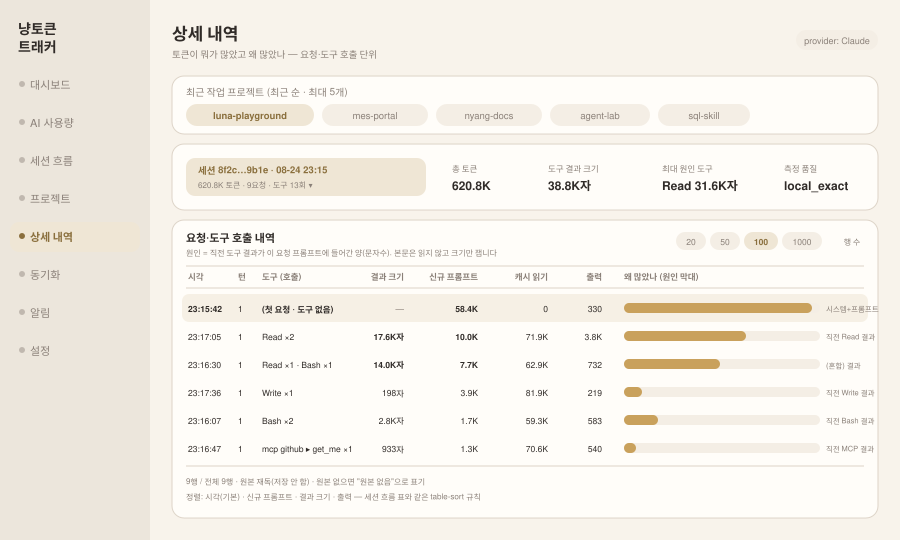

# 상세 내역 (`detail`)

**현재 상태: 미구현 (설계).** 새 탭입니다.

> 개정 이력: 첫 설계에는 "왜 많았나"를 도구 결과 크기(원인 사슬)로 답하는 열이
> 있었습니다. resume 사본·sidechain·컴팩션 경계 처리가 얹히며 복잡해져 **v1에서
> 뺐습니다.** 이 화면의 축은 셋뿐입니다 — **프로젝트(cwd) → 세션 → 도구, 토큰량.**
> "왜"는 도구별 토큰량이 가리키는 곳을 [내용 보기]로 사람이 직접 확인합니다.

## 이 화면이 답하는 질문

세션별 상세를 **시작점**으로, 토큰량이 어디로 갔는지를 세 계층으로 내려갑니다.

```text
프로젝트 (cwd 귀속, 최근 작업 순 최대 5개)
  └ 세션 (최근 순)
      └ 도구 (채팅 / 도구별 / MCP별 토큰량)
          └ 요청 행 (시각·턴·도구·토큰) + [내용 보기] 팝업
```

- **뭐가 많았나** → 도구별 토큰량과 요청 행의 토큰 열이 답합니다
- **왜 많았나** → 많이 쓴 도구의 [내용 보기]를 눌러 실제 input·결과를 확인합니다

새 회계 규칙은 만들지 않습니다. 세 계층 전부 **이미 구현·검증된 규칙을 재사용**합니다.

| 계층 | 규칙 | 출처 |
|---|---|---|
| 프로젝트 | cwd 귀속, 경로 가림 | project.md (M2 구현) |
| 세션 | 요청 usage 의 eventKey 중복 제거, 프롬프트 토큰 = 회계별 합산 | session.md (M8 구현) |
| 도구 | 요청 토큰을 호출 비율로 배분 — 인과가 아니라 배분이므로 "추정 배분" 표기 | 턴 상세 (구현) |

## 화면 미리보기



## 데이터 근거 (검증 완료)

설계 전에 실측(이 리포지토리를 작업한 원격 세션의 실제 Claude Code JSONL, 이름·개수·
크기·토큰만 재는 프로브)과 웹 자료로 확인했습니다.

- 요청 단위 usage(input / cache_read / cache_creation / output / thinking) 커버리지 100% —
  Anthropic Messages API 공식 문서와 필드명 일치
- `tool_use` 블록(id·name)과 `tool_result`(tool_use_id·content 본문)가 로그에 저장됨 —
  본문은 레코드당 두 곳(`.toolUseResult`, `message.content[].content`)에 남는 것까지 확인
- JSONL 토큰 신뢰성 이슈(입력 플레이스홀더, thinking 누락)는 기존 파서의 버전 게이트
  (2.1.143 / 2.1.228)와 `measurementQuality` 가 이미 다루고 있음

즉 토큰량 계층에 필요한 데이터는 전부 있고 파서가 이미 뽑고 있습니다. [내용 보기]가
쓰는 본문도 로그에 있습니다 — 파서가 아니라 별도 리더가 요청 시 읽습니다(아래).

## 화면 요소

| 영역 | 내용 |
|---|---|
| 최근 프로젝트 | **최근 작업 순 최대 5개** 칩 (cwd 귀속). 첫 칩이 기본 선택. 경로 가림 규칙은 프로젝트 화면과 동일 |
| 세션 선택 | 선택 프로젝트의 최근 세션 목록(최근 순) — `getSessionRanking` 을 프로젝트 필터로 좁혀 재사용 |
| 도구별 토큰량 | 선택 세션 전체의 채팅/도구/MCP 배분 막대 + 도구별 상위 목록. 턴 상세와 같은 배분 규칙·같은 "추정 배분" 표기 |
| 요청 행 표 | 시각 · 턴 · 도구(호출) · 신규 프롬프트(input+cacheWrite) · 캐시 읽기 · 출력 · 합계 |
| 행 수 | **20 / 50 / 100 / 1000, 기본 100.** 서버 recordLimit 과 화면 표시가 같은 값 |
| 정렬 | 기본 시각순, 합계·신규 프롬프트·출력으로 정렬 가능 — `src/table-sort.js` 재사용 |
| 내용 보기 | 도구 호출이 있는 행의 **[보기]** 버튼. 클릭 시에만 전용 엔드포인트를 불러 팝업(모달)에 표시 (아래 절) |
| 이동 | 행의 턴 번호 클릭 → 세션 흐름 화면의 그 턴 상세 (기존 focus 인자 방식) |

행이 상한을 넘으면 "N행 / 전체 M행"으로 잘렸음을 표기합니다 — 조용히 자르지 않습니다.
잘림이 답을 가리지 않도록 서버는 `order=cost`(합계 상위 N) / `order=time` 두 모드를
받고, 기본은 `cost` 입니다 — 이 화면의 목적이 "뭐가 많았나"이기 때문입니다.

## 내용 보기: 명시적 열람만, 저장은 없음

도구별 토큰량이 "Read 가 많이 썼다"까지 답하면, 다음 질문 "그래서 뭘 읽었길래"는
본문 없이는 답할 수 없습니다. 각 도구 호출 행의 **[보기]** 버튼이 그 호출 하나의
`tool_use.input` 과 `tool_result` 본문을 원본에서 그 자리에서 읽어 **팝업(모달)** 으로
띄웁니다.

이것은 "본문은 읽지 않는다" 경계([session.md](./session.md#설계-원칙-본문-없이-절차를-본다))를
문단 하나만큼 여는 결정이므로, 여는 조건을 못박습니다.

| 조건 | 규칙 |
|---|---|
| 기본은 닫힘 | 목록(records)·집계 응답에는 결과 데이터(본문·프리뷰)가 **포함되지 않습니다**. 센티넬 검사가 그대로 지킵니다 |
| 클릭 시에만 | 본문 요청은 [보기] 클릭이 팝업을 열 때만 발생합니다 — 선요청 금지. 팝업을 닫으면 본문은 화면 상태에서도 버립니다(재열람은 재요청) |
| 전용 통로 | 본문은 별도 엔드포인트가 나르고, 요청한 **tool_use_id 하나**의 input·결과만 담습니다 |
| 저장 없음 | SQLite·캐시·서버 로그 어디에도 저장하지 않습니다. 응답은 `Cache-Control: no-store` |
| 크기 상한 | 응답 본문 256KB 상한 — 넘으면 앞부분 + `truncated: true` (Codex 로그는 결과 하나가 수 MB 일 수 있음) |
| 가림 존중 | 경로 가림된 프로젝트에서는 버튼 비활성, 엔드포인트도 `reason: 'redacted'` 로 거부 |
| 원본 없으면 없음 | 원본이 지워졌으면 "원본 없음" — 원장에서 지어내지 않습니다 |
| 위험 고지 | 도구 출력에는 자격증명이 남을 수 있습니다(실제 유출 사례가 웹에 보고됨). 뷰어 상단에 경고 상시 표기 |

성격은 기존 privacy-safe local log inspector 와 같습니다 — 로그 소유자가 자기 로컬
로그를 자기 화면에서 열람하는 것이고, 트래커가 본문을 가공·요약·색인하는 것이
아닙니다. **파서는 이 경로를 타지 않습니다**: 뷰어는 원본 파일의 해당 레코드를 직접
읽는 별도 리더를 쓰고, 파서가 내보내는 이벤트에는 여전히 본문이 없습니다.

## 파서 변경: 한 가지뿐

토큰량 계층은 파서가 이미 내보내는 것(usage·toolCounts·turnIndex)으로 전부
만들어집니다. 필요한 추가는 **[내용 보기]가 호출을 가리킬 손잡이** 하나입니다:

```text
toolActivity 가 도구 이름과 함께 tool_use 블록의 id 를 수집
→ usage 이벤트에 toolCalls: [{ id, tool }]  (이름과 같은 급의 구조 메타데이터, 본문 아님)
```

결과 크기·원인 추적은 넣지 않습니다. 그래서 resume/sidechain/컴팩션 경계 처리도
필요 없습니다 — 토큰은 eventKey 중복 제거가 이미 지키고 있습니다.

## 원장이 아니라 원본을 다시 읽습니다

턴 상세와 같은 결정, 같은 대가입니다([session.md](./session.md#원장이-아니라-원본을-다시-읽습니다)).
행 데이터는 요청이 올 때 그 세션의 원본 파일들을 처음부터 읽어 만들고 저장하지
않습니다. 턴 상세와 다른 점은 턴 필터 없이 **세션 전체**를 모은다는 것뿐입니다 —
읽는 파일 셋과 스캔 비용은 같고, 모으는 행 수만 다릅니다.

## 필요한 API

```text
GET /api/v1/projects/recent?limit=5
    → { projects: [{ projectKey, projectName, lastEventAt, tokens, provider }] }
    -- 대시보드 recents(최근 순, M9)와 같은 쿼리를 limit 만 좁혀 재사용

GET /api/v1/sessions/:sessionId/records?provider&limit=100&order=cost|time
    → { session, supported, available, reason,
        totals: { totalTokens, promptTokens, outputTokens, requestCount, toolCalls },
        toolBreakdown: [{ key, label, tokens, calls, share }],   -- 턴 상세와 같은 배분
        records: [{ seq, at, turnIndex, category, model, sidechain,
                    measurementQuality,
                    tokens: { inputTokens, cachedInputTokens, cacheWriteInputTokens,
                              outputTokens, reasoningTokens, promptTokens, totalTokens },
                    tools, paths,
                    toolCalls: [{ id, tool }] }],   -- 내용 보기용 id. 본문 없음
        recordCount, truncated,
        source: { files: [{ path, exists, lines, bytes }], missing } }

GET /api/v1/sessions/:sessionId/tool-calls/:toolUseId/content?provider
    → { supported, available, reason,
        tool, at, turnIndex,
        input:  { chars, content, truncated },
        result: { chars, content, truncated },
        source: { path, line } }
    -- 본문이 나가는 유일한 통로. [보기] 클릭이 팝업을 열 때만 호출.
    -- Cache-Control: no-store, 저장 없음, 256KB 상한,
    -- 가림 프로젝트는 available: false, reason: 'redacted'
```

`limit` 은 20·50·100·1000 만 받고 그 외는 100으로 접습니다. 가림된 프로젝트에서는
경로 문자열이 응답에 나가지 않는 규칙(턴 상세와 동일)을 그대로 적용합니다.
API 서버는 로컬 바인딩·기존 origin 등록 규칙을 그대로 따릅니다 — content 엔드포인트가
생겨도 노출 면을 넓히지 않습니다.

## 필요한 스토어 쿼리

새 테이블·새 컬럼 없음.

```js
getRecentProjects({ limit: 5 })              // 대시보드 recents 재사용
getSessionRanking({ projectKey, limit })     // 세션 목록 — 기존 쿼리에 프로젝트 필터
getSessionSources({ provider, sessionId })   // 턴 상세가 쓰는 원본 파일 목록 그대로
```

## provider별 지원

| provider | 상태 | 근거 |
|---|---|---|
| Claude | 대상 | 토큰·도구·턴이 전부 파서에 있고 실측 검증됨 |
| Codex | 보류 (`supported: false, reason: 'unverified'`) | `call_id` 연결은 웹 자료로만 확인 — 실물 로그 검증 후 켭니다 |
| Gemini · Cursor | 미지원 | 턴 상세와 같은 이유 |

## 완료 기준

`test/session-records.test.mjs` 로 검사합니다.

- [ ] 도구별 토큰량 합계가 원장의 세션 합계와 일치 (턴 상세의 배분 규칙 재사용 확인)
- [ ] resume 사본이 있어도 행·합계가 부풀지 않음 (eventKey 중복 제거 승계)
- [ ] `order=cost` 가 합계 상위 N 을, `order=time` 이 시간순 앞 N 을 주고, 잘리면 `truncated` 와 전체 행 수 표기
- [ ] 행 상한 20/50/100/1000 이 서버·화면에서 같은 값
- [ ] records·toolBreakdown 응답에 센티넬(본문) 부재 — 본문은 content 엔드포인트에만
- [ ] content 요청이 [보기] 클릭(팝업 열기)에서만 발생 — 목록 렌더링이 선요청하지 않음
- [ ] 팝업을 닫으면 본문이 화면 상태에서 버려지고, 다시 열면 재요청됨
- [ ] 내용 보기를 호출한 뒤에도 SQLite 바이트에 센티넬 부재 — 열람이 저장을 만들지 않음
- [ ] content 응답에 `Cache-Control: no-store` 와 256KB 상한이 적용됨
- [ ] 가림 프로젝트에서 content 가 `reason: 'redacted'` 로 거부되고 버튼 비활성
- [ ] 원본이 없으면 `available: false, reason: source_missing` — 지어내지 않음
- [ ] 최근 프로젝트가 최근 작업 순 최대 5개, 가림 규칙 적용
- [ ] Codex/Gemini/Cursor 는 빈 상세가 아니라 `supported: false` 와 이유
- [ ] 행의 턴 번호 클릭 시 세션 흐름 화면의 해당 턴이 열림 (focus 인자)

## 하지 않는 것

- 원인(도구 결과 크기) 추적 — v1에서 제외. 필요해지면 별도 설계로 다시 옵니다(개정 이력 참조)
- 도구 결과 본문을 저장하거나 목록·집계 응답에 싣기 — 본문은 [내용 보기] 전용 엔드포인트뿐
- 본문을 요약·색인·검색 대상으로 만들기 — 열람은 표시로 끝나고 파생물을 만들지 않습니다
- 배분을 인과처럼 표기하기 — 도구별 토큰량은 턴 상세와 같은 "추정 배분"입니다
- 새 회계 규칙 만들기 — 프롬프트 토큰 합산은 `accounting.mjs` 한 곳을 그대로 봅니다
- 검증 안 된 provider 를 픽스처만으로 켜기 — Codex 는 실물 로그 검증 후에 켭니다
