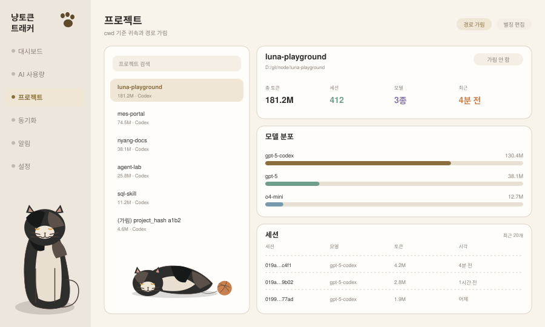

# 프로젝트 (`project`)

**현재 상태: 미구현.** 대시보드에 최근 6개 요약만 있습니다(`snapshot.projects`).

프로젝트 귀속은 provider마다 근거가 다릅니다. Codex는 세션의 `cwd`, Claude는 대화 파일이 놓인 프로젝트 디렉터리, Gemini는 **경로를 해시한 `<project_hash>`** 입니다. 이 화면은 그 차이를 감추지 않고 드러내야 합니다.

## 화면 미리보기



## 화면 요소

| 영역 | 내용 |
|---|---|
| 좌측 목록 | 프로젝트 검색, 토큰 순 정렬, provider 표시. 가림된 항목은 별칭/해시로 표시 |
| 상세 헤더 | 프로젝트명, 실제 경로, 가림 토글 |
| 요약 4칸 | 총 토큰 / 세션 수 / 사용 모델 수 / 최근 활동 |
| 모델 분포 | 해당 프로젝트 내 모델별 비중 |
| 세션 표 | 세션 id, 모델, 토큰, 시각 (최근 N개) |

## 귀속 규칙

| provider | 귀속 근거 | 실패 시 |
|---|---|---|
| Codex | 세션 `turn_context.cwd` | `(미분류)` 버킷 |
| Claude | `~/.claude/projects/<dir>` 이름 | 디렉터리명 그대로 |
| Gemini | `<project_hash>` — **역매핑 불가** | 해시 앞 4자리 표시, 세션 메타의 경로가 있으면 우선 |
| Cursor | Admin API는 프로젝트 정보를 주지 않음 | 프로젝트 화면에 나타나지 않음 (provider 단위로만 집계) |

Cursor가 이 화면에 없는 것은 결함이 아니라 **원본에 정보가 없다는 사실**입니다. 목록 하단에 그렇게 표기합니다.

## 경로 가림

프로젝트 경로에는 고객사명·사내 코드명이 들어갑니다. 스크린샷 공유나 화면 공유 상황을 위해 가림이 필요합니다.

```sql
-- store-extensions.md §7
project_aliases(provider, project_key, alias, redacted, updated_at)
```

- `redacted = 1`이면 **서비스가 스냅샷을 만들 때** `cwd`를 빈 값으로 치환하고 별칭만 내보냅니다. 클라이언트에서 CSS로 가리는 방식이 아닙니다 — 그러면 HTTP 응답에 원본이 남습니다.
- 원본 경로는 로컬 SQLite에만 남습니다.
- 별칭은 목록·상세·시계열·CSV 내보내기 전부에 일관 적용합니다.

## API

```
GET  /api/v1/projects?since=&until=&provider=&limit=
       → { projects: [{ key, provider, alias, redacted, tokens, sessionCount, lastActivityAt }] }
GET  /api/v1/projects/:key?since=&until=
       → { project, tokens, models: [...], sessions: [...] }
PUT  /api/v1/projects/:key/alias   { alias, redacted }
```

`:key`는 경로 그대로가 아니라 **해시**를 씁니다. 원본 경로를 URL에 넣으면 서버 로그·브라우저 히스토리에 남습니다.

## 스토어 쿼리

```js
getProjectBreakdown({ provider, since, until, limit })
getProjectDetail({ projectKey, since, until })
getProjectSessions({ projectKey, limit })
```

기존 `getRecentProjectsAcrossProviders(6, since)`는 대시보드 요약 전용으로 남기고, 이 화면은 정렬·필터·페이지네이션이 가능한 신규 쿼리를 씁니다.

## 상태 처리

| 상황 | 표시 |
|---|---|
| 프로젝트 0개 | 첫 수집 안내 |
| `cwd` 없는 세션 | `(미분류)` 프로젝트로 묶고 이유 표기 |
| Gemini 해시만 있음 | `(가림) project_hash a1b2` 형태, 별칭 지정 유도 |
| 가림된 프로젝트 | 목록·상세·내보내기 모두 별칭 |

## 완료 기준

- [ ] 가림 켠 프로젝트의 원본 경로가 HTTP 응답 어디에도 없음 (테스트로 확인)
- [ ] 프로젝트 토큰 합이 provider 총합 이하이고, `(미분류)` 포함 시 정확히 일치
- [ ] URL에 원본 경로가 노출되지 않음
- [ ] 별칭이 CSV 내보내기까지 반영

## 하지 않는 것

- Gemini 해시를 역산하려고 시도하기 (사전 공격식 추정)
- 프로젝트 경로에서 사용자명을 자동 추출해 표시하기
