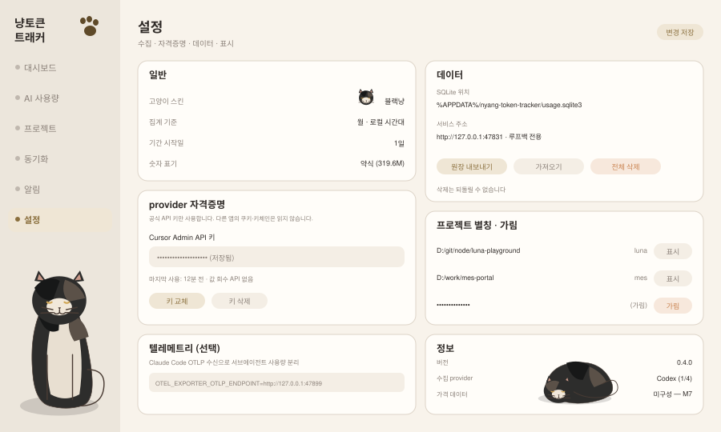

# 설정 (`settings`)

**현재 상태: 미구현.** 고양이 스킨 선택만 헤더에 있고 `localStorage`에 저장됩니다(`nyangtracker-cat-theme`).

설정은 **어디에 저장되는가**로 두 종류로 갈립니다. 표시 취향은 브라우저에, 수집·자격증명은 서비스(SQLite)에 저장합니다. 브라우저를 바꾸면 테마는 초기화돼도 수집 설정은 유지돼야 합니다.

## 화면 미리보기



## 화면 요소

| 섹션 | 항목 | 저장 위치 |
|---|---|---|
| 일반 | 고양이 스킨, 집계 기준(월/주), 기간 시작일, 숫자 표기 | `localStorage` |
| provider 자격증명 | Cursor Admin API 키 | SQLite `provider_credentials` |
| 텔레메트리(선택) | Claude Code OTLP 수신 켜기/끄기, 안내할 환경변수 | SQLite 설정 테이블 |
| 데이터 | SQLite 경로, 서비스 주소, 내보내기/가져오기/전체 삭제 | 서비스 |
| 프로젝트 별칭·가림 | 경로별 별칭과 가림 여부 | SQLite `project_aliases` |
| 정보 | 버전, 연결된 provider 수, 가격 데이터 상태 | — |

## 자격증명 처리

Cursor만 API 키가 필요합니다([provider-token-api.md §5.3](../provider-token-api.md)). 규칙은 짧고 엄격합니다.

1. 입력은 이 화면에서만. 사용자가 직접 붙여넣습니다.
2. 저장은 서비스 프로세스가 SQLite에 합니다.
3. **회수 API를 만들지 않습니다.** 클라이언트에 내려가는 것은 `{ configured: true, lastUsedAt }`뿐입니다.
4. `/api/v1/diagnostics`, 스냅샷, SSE, 로그 어디에도 키가 나타나지 않습니다.
5. 다른 앱의 키체인·쿠키·로컬 상태 DB에서 자격증명을 가져오지 않습니다(규칙 R6).

```
PUT    /api/v1/providers/cursor/credentials   { apiKey }   → { configured: true }
DELETE /api/v1/providers/cursor/credentials              → { configured: false }
GET    /api/v1/providers/cursor/credentials              → { configured, lastUsedAt }
```

화면에는 저장 위치(SQLite 파일 경로)를 명시합니다. OS 키체인 연동 전까지는 **파일 권한이 유일한 보호**이므로 사용자가 그 사실을 알아야 합니다.

## 데이터 관리

| 동작 | 내용 |
|---|---|
| 내보내기 | 로컬 원장을 JSON/CSV로. 별칭·가림 설정을 적용한 상태로 내보냄 |
| 가져오기 | 다른 기기의 내보내기 파일 병합. `event_key` 기준 중복 제거 |
| 전체 삭제 | SQLite 테이블 비우기. **되돌릴 수 없음** — 확인 절차 필요 |

가져오기는 기기 간 병합이므로 `event_key`가 없는 레코드는 건너뜁니다(중복 판정 불가). 이 제약을 화면에 표기합니다.

## 서비스 설정 표시

환경변수로만 바꿀 수 있는 값은 **읽기 전용으로 보여주고** 변경 방법을 안내합니다.

| 값 | 환경변수 | 표시 |
|---|---|---|
| 서비스 포트 | `NYANG_PORT` | `http://127.0.0.1:47831` |
| 리슨 주소 | `NYANG_HOST` | `127.0.0.1 · 루프백 전용` |
| 데이터 경로 | `NYANG_USER_DATA` | 실제 경로 |
| 원격 허용 | `NYANG_ALLOW_REMOTE` | 꺼져 있음(기본) |

포트·경로를 UI에서 바꾸게 만들지 않는 이유: 서비스가 자기 리슨 주소를 런타임에 바꾸면 클라이언트가 들고 있는 접속 정보가 무효화되고, 재시작 없이는 복구할 수 없습니다.

## 텔레메트리 섹션 (선택 기능)

Claude Code OTLP 수신을 켜면 서비스가 수신 지점을 열고, 사용자가 셸에 설정할 환경변수를 그대로 보여줍니다.

```bash
CLAUDE_CODE_ENABLE_TELEMETRY=1
OTEL_METRICS_EXPORTER=otlp
OTEL_EXPORTER_OTLP_PROTOCOL=http/protobuf
OTEL_EXPORTER_OTLP_ENDPOINT=http://127.0.0.1:<서비스가 배정한 포트>
```

수신 지점은 루프백에만 바인딩합니다. 이 경로로 들어온 값은 JSONL 레인을 덮어쓰지 않고 별도 레인으로 저장합니다(규칙 R8).

## 상태 처리

| 상황 | 표시 |
|---|---|
| 자격증명 미설정 | `설정 필요` + 해당 provider가 왜 필요한지 한 줄 |
| 가격 데이터 없음 | `미구성 — M7`, 비용 화면 비활성 |
| 원격 바인딩 켜짐 | 경고 배너 — TLS·인증 프록시 없이는 위험 |
| 삭제 진행 중 | 진행 표시 후 재수집 안내 |

## 완료 기준

- [ ] 표시 설정은 브라우저에, 수집·자격증명 설정은 SQLite에 저장됨
- [ ] 저장된 API 키가 어떤 HTTP 응답에도 포함되지 않음 (테스트로 확인)
- [ ] 환경변수 전용 값이 읽기 전용으로 표시됨
- [ ] 전체 삭제가 확인 절차를 요구하고, 실행 후 진단 카운터가 0이 됨
- [ ] 별칭·가림 변경이 즉시 스냅샷에 반영됨

## 하지 않는 것

- API 키를 클라이언트로 되돌려주는 API
- 다른 앱 저장소에서 자격증명 자동 수집
- UI에서 리슨 주소·포트 변경
