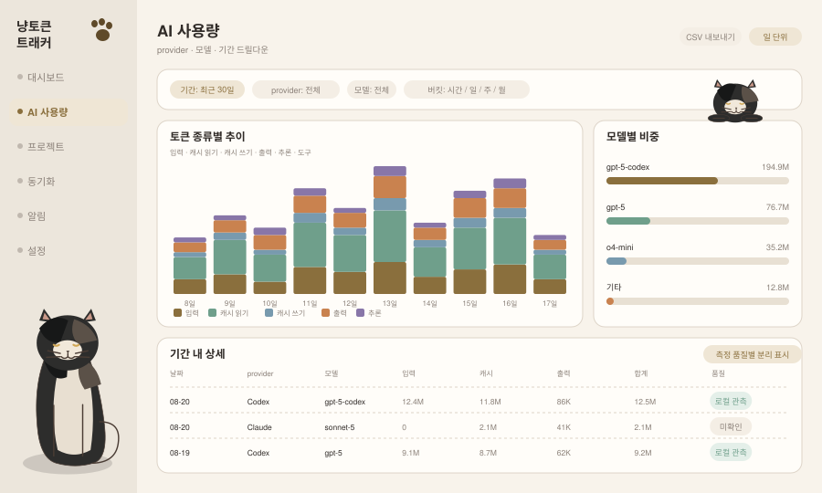

# AI 사용량 (`usage`)

**현재 상태: 미구현.** 메뉴를 눌러도 대시보드가 그대로 보입니다.

대시보드가 "지금 상태"를 보여주는 화면이라면, 이 화면은 **기간 · provider · 모델 · 토큰 종류로 쪼개 보는** 화면입니다.

## 화면 미리보기



## 화면 요소

| 영역 | 내용 |
|---|---|
| 필터 바 | 기간(최근 7/30일, 이번 달, 사용자 지정), provider, 모델, 버킷(시간/일/주/월) |
| 추이 차트 | 버킷별 **토큰 종류 누적 막대** — 입력 / 캐시 읽기 / 캐시 쓰기 / 출력 / 추론 / 도구 |
| 모델별 비중 | 기간 내 모델별 합계와 비율 |
| 상세 표 | 버킷 × provider × 모델 행, 토큰 종류별 열, 마지막 열은 측정 품질 |
| 내보내기 | 현재 필터 결과를 CSV로 (M7) |

토큰 종류를 6개로 쪼개는 이유는 provider마다 제공 범주가 달라서입니다 — Codex에는 도구 토큰이 없고, Gemini에는 캐시 쓰기가 없습니다. 하나로 합치면 "왜 provider마다 합이 다르게 보이는가"를 설명할 수 없습니다.

## API

```
GET /api/v1/usage/timeseries?bucket=day&since=&until=&provider=&model=
  → { bucket, series: [{ bucketStart, provider, model, tokens: {...}, quality }] }

GET /api/v1/usage/models?since=&until=&provider=
  → { models: [{ model, provider, tokens: {...}, share, quality }] }

GET /api/v1/usage/events?since=&until=&provider=&model=&page=&pageSize=
  → { rows: [...], page, pageSize, total }     // 상세 표 (페이지네이션)
```

**설계 결정 — 시계열은 스냅샷에 싣지 않습니다.** SSE 스냅샷은 현재 상태 전량을 매 갱신마다 브로드캐스트하는 구조입니다. 여기에 기간 시계열까지 넣으면 갱신마다 전 구간을 재집계하게 되고, 클라이언트마다 다른 필터를 서버가 기억해야 합니다. 시계열은 필터 변경 시 REST로만 당깁니다. 대신 SSE `snapshot` 이벤트가 오면 화면은 **현재 필터를 유지한 채 재요청**합니다.

## 스토어 쿼리

[store-extensions.md §8](../store-extensions.md)의 신규 메서드를 씁니다.

```js
getUsageTimeseries({ provider, model, bucket, since, until })
getModelBreakdown({ provider, since, until })
```

버킷 키는 SQLite `strftime`으로 만들고, **로컬 시간대 기준**으로 끊습니다. 엔진이 이미 `startOfLocalMonthIso()`로 로컬 월 경계를 쓰므로 기준을 통일해야 합니다. UTC로 끊으면 대시보드 월 합계와 이 화면의 월 합계가 어긋납니다.

인덱스는 기존 `idx_usage_events_provider_time`(provider, observed_at)이 대부분 커버합니다. 모델 필터가 느려지면 `(provider, model, observed_at)` 인덱스를 추가합니다 — 사전 집계 테이블은 만들지 않습니다.

## 상태 처리

| 상황 | 표시 |
|---|---|
| 기간 내 데이터 없음 | 차트 영역에 빈 상태 + 수집 상태 확인 링크 |
| 단일 provider만 연결 | provider 필터는 표시하되 연결된 것만 선택 가능 |
| 품질이 낮은 provider 포함 | 차트 위에 "일부 값은 미확인" 주석 + 해당 시리즈에 사선 패턴 |
| 도구/추론 토큰 미제공 provider | 범례에서 회색 처리, 0으로 채우지 않음 |

## 완료 기준

- [ ] 토큰 종류별 합이 provider 총합과, provider 총합이 대시보드 총합과 일치
- [ ] 버킷 경계가 로컬 시간대 기준
- [ ] 필터 변경이 REST 재요청만 유발하고 SSE 구독은 유지
- [ ] 미제공 범주가 0이 아니라 미표시로 구분됨
- [ ] 상세 표 페이지네이션이 1000행 이상에서 동작

## 하지 않는 것

- 캐시 읽기 토큰을 입력 토큰에 합산 (이중 계상, 규칙 R4)
- 없는 범주를 0으로 채워 총합을 그럴듯하게 만들기 (규칙 R7)
